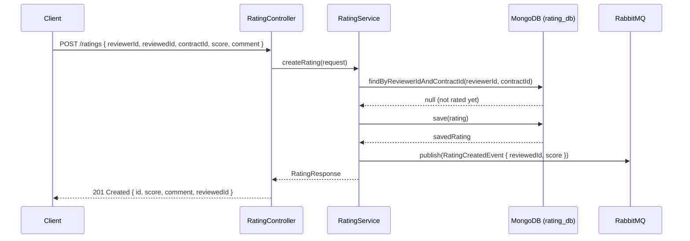
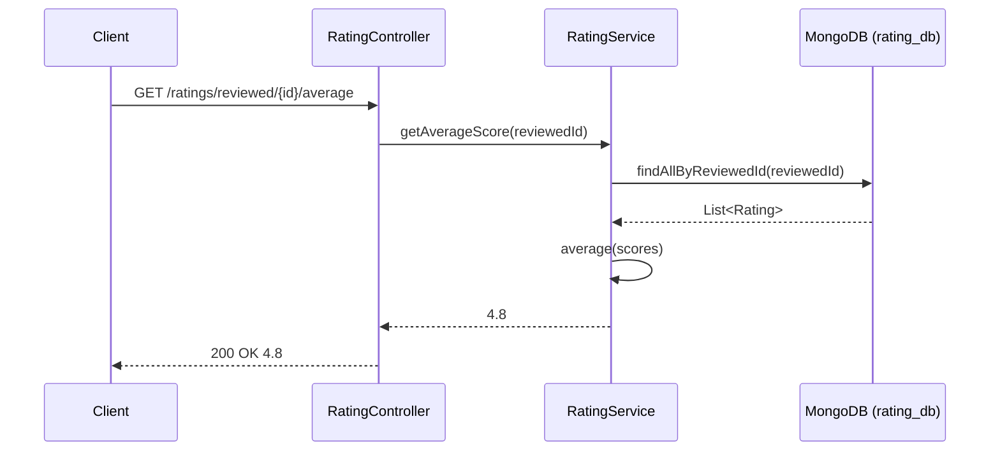
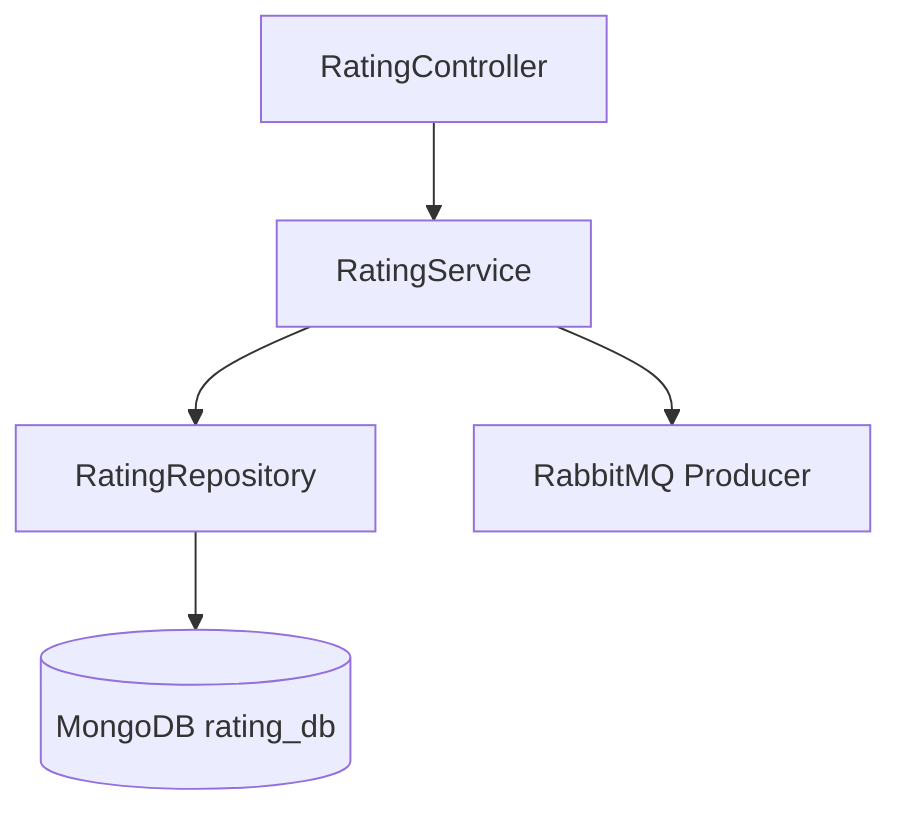

# ⭐ Rating Service

Microservice responsible for managing service ratings and reviews in the Clean Pro Solutions platform. Allows clients to rate contractors after service completion and calculates average scores.

---

## 📋 Service Info

| Property     | Value                       |
|--------------|-----------------------------|
| Port         | `8088`                      |
| Database     | MongoDB — `rating_db`       |
| RabbitMQ     | Consumer                    |
| Registry     | Eureka (`rating-service`)   |

---

## 🔄 Main Flow — Sequence Diagram

### Rating Submission Flow



### Average Rating Query



---

## 🏗️ Internal Architecture



---

## 📡 API Endpoints

| Method | Path                              | Request Body                                                    | Response                    |
|--------|-----------------------------------|-----------------------------------------------------------------|-----------------------------|
| POST   | `/ratings`                        | `{ reviewerId, reviewedId, contractId, score (1-5), comment }` | `201 RatingResponse`        |
| GET    | `/ratings/reviewed/{id}`          | —                                                               | `200 [ RatingResponse ]`    |
| GET    | `/ratings/reviewed/{id}/average`  | —                                                               | `200 4.8` (raw Double)      |

> **Important:** `/ratings/reviewed/{id}/average` returns a raw `Double` value (e.g., `4.8`), not a JSON object.

---

## ⚙️ Environment Variables

| Variable                    | Description              | Default                                    |
|-----------------------------|--------------------------|--------------------------------------------|
| `SPRING_DATA_MONGODB_URI`   | MongoDB connection URI   | `mongodb://localhost:27017/rating_db`      |
| `RABBITMQ_HOST`             | RabbitMQ host            | `localhost`                                |
| `RABBITMQ_PORT`             | RabbitMQ port            | `5672`                                     |
| `EUREKA_SERVER_URL`         | Eureka registry URL      | `http://localhost:8761/eureka`             |

---

## 🚀 Build & Run

### Build
```bash
mvn clean install
```

### Run locally
```bash
mvn spring-boot:run
```

### Run with Docker Compose
```bash
docker-compose up rating-service
```

---

## 🧪 How to Test

### Submit a rating
```bash
curl -X POST http://localhost:8088/ratings \
  -H "Content-Type: application/json" \
  -d '{
    "reviewerId": "64a1b2c3d4e5f6a7b8c9d0e1",
    "reviewedId": "64a1b2c3d4e5f6a7b8c9d0e2",
    "contractId": "64a1b2c3d4e5f6a7b8c9d0e5",
    "score": 5,
    "comment": "Excelente profissional, serviço impecável!"
  }'
```

### Get all ratings for a contractor
```bash
curl http://localhost:8088/ratings/reviewed/64a1b2c3d4e5f6a7b8c9d0e2
```

### Get average score for a contractor
```bash
curl http://localhost:8088/ratings/reviewed/64a1b2c3d4e5f6a7b8c9d0e2/average
# Response: 4.8
```

---

## 🗂️ Project Structure

```
clean-pro-solutions-rating-service/
├── src/main/java/
│   └── com/cleanpro/rating/
│       ├── controller/     # REST endpoints
│       ├── service/        # Rating business logic
│       ├── repository/     # MongoDB repositories
│       ├── dto/            # Request/Response records
│       ├── model/          # Rating entity
│       ├── config/         # RabbitMQ config
│       └── exception/      # Custom exceptions
├── src/test/
└── pom.xml
```

---

© 2026 Clean Pro Solutions — Developed by **Emerson Lima**
